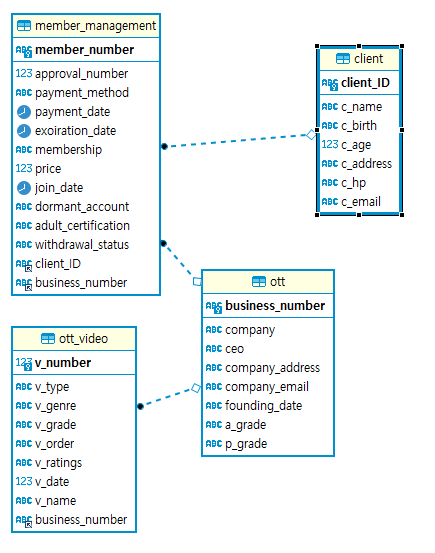

# OTT 회원관리 데이터 베이스 만들기

## 주제
 - 데이터베이스를 이용하여 회원이 멤버십 결제를 하고 OTT플랫폼을 이용하는 시스템을 알아보았습니다.

# ERD Modeling


# 엔티티 관계도


# 쿼리

1.고객정보 전체 조회하기
```sql
select * from client
```


2. ott 전체 조회하기
```sql
select * from ott
```


3. 회원별 ott가입수와 이름,ID 조회하기
```sql
select c.c_name as '이름',c.client_ID as '회원ID' ,count(mm.client_ID) as '가입수' from client as c inner join member_management as mm on c.client_ID = mm.client_ID group by c.client_ID 
```


4. ott별 휴면계정 회원수,탈퇴회원수와 ott회사명 조회하기
```sql
select o.company as '회사명',count(mm.dormant_account) as '휴면계정회원수',count(mm.withdrawal_status) as '탈퇴회원수' 
from ott as o inner join member_management as mm on o.business_number = mm.business_number
where mm.dormant_account='Y' group by o.business_number
```


5. ott 멤버십의 가격과 회사명 조회하기
```sql
select mm.membership as '멤버십', mm.price as '가격',o.company as '회사명'
from ott as o inner join member_management as mm on o.business_number = mm.business_number group by mm.price
```


6. 결제만료일이 10월달인 회원의 이름과 아이디,결제만료일 조회하기
```sql
select c.client_ID as '회원ID',c.c_name as '회원이름',mm.exoiration_date as '결제만료일'
from client as c inner join member_management as mm on c.client_ID = mm.client_ID where date_format(mm.exoiration_date,'%m')='10'
```


7. 티빙을 이용하는 고객들의 이름,ID,멤버십,결제일,가격 조회하기
```sql
select o.company as '회사명',c.c_name as '회원이름',c.client_ID as '회원ID', mm.membership as '멤버십', mm.price as '가격', mm.payment_date as '결제일'
from ott as o inner join member_management as mm on o.business_number = mm.business_number inner join client as c on c.client_ID = mm.client_ID 
where o.company ='티빙'
```


8. 넷플릭스에서 성인인증을 하지 않은 회원이 볼수 있는 영상의 제목과 영상등급 성인인증여부 회원이름 조회하기
```sql
select c.c_name as '이름',mm.adult_certification as '성인인증여부',o.company as '회사명', ov.v_name as '영상제목', ov.v_type '영상타입',ov.v_genre as '영상장르',ov.v_ratings as '영상등급'
from ott_video as ov inner join ott as o on ov.business_number = o.business_number 
inner join member_management as mm on mm.business_number = o.business_number 
inner join client as c on mm.client_ID = c.client_ID 
where o.company ='넷플릭스' and mm.adult_certification ='N' and ov.v_ratings != '청소년관람불가'
```


9. 휴면계정이고 탈퇴한 고객의 이름과 ID ,ott명 조회하기
```sql
select c.c_name as '회원이름', c.client_ID as '회원ID', mm.dormant_account as '휴면계정여부',mm.withdrawal_status as '탈퇴여부',o.company as '회사명'
from client as c inner join member_management as mm on c.client_ID = mm.client_ID 
inner join ott as o on o.business_number = mm.business_number 
where mm.dormant_account = 'Y' and mm.withdrawal_status = 'Y'
```
